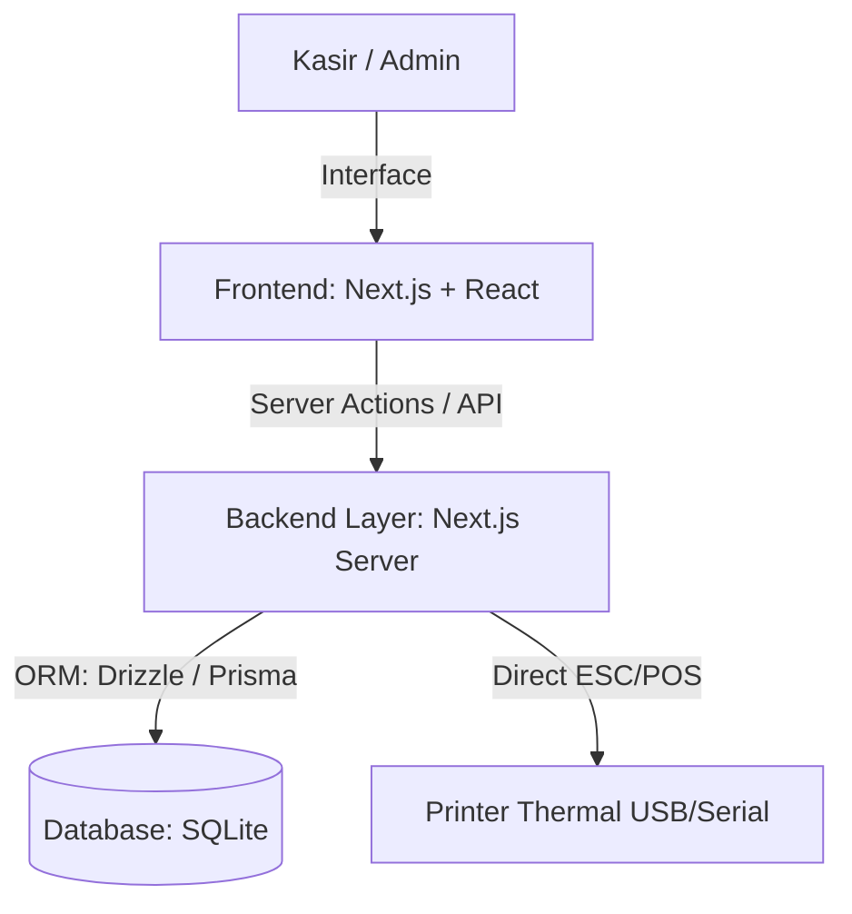
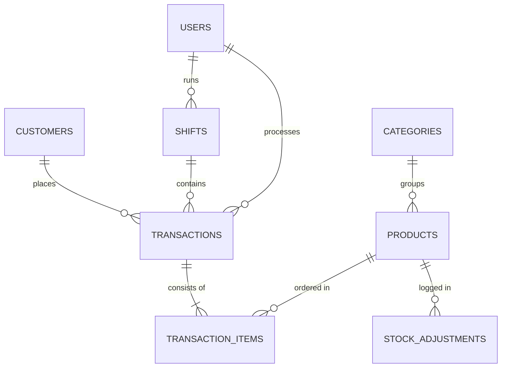

# Product Requirement Document (PRD)
## Sistem Point of Sale (POS) Minimarket

| Aspek | Detail |
| :--- | :--- |
| **Nama Proyek** | **MiniPOS** - Sistem POS Minimarket Terintegrasi |
| **Status** | Draft / Usulan |
| **Target Database** | SQLite (Local/Embedded) |
| **Tanggal Pembuatan**| 12 Juli 2026 |
| **Bahasa Utama** | Indonesia |

---

## 1. Latar Belakang & Tujuan
Minimarket memerlukan sistem kasir yang cepat, andal, dan mudah digunakan. Masalah utama pada minimarket kelas menengah ke bawah adalah koneksi internet yang tidak stabil dan biaya pemeliharaan server cloud yang mahal. 

**MiniPOS** dirancang sebagai sistem POS desktop/web-hybrid lokal yang menggunakan database **SQLite**. SQLite dipilih karena memiliki nol konfigurasi (*zero-configuration*), sangat cepat untuk transaksi lokal, tidak memerlukan server database terpisah, dan memiliki keandalan tinggi (ACID compliant) untuk menghindari korupsi data transaksi kasir.

### Tujuan Proyek:
1. Menyediakan aplikasi POS berkinerja tinggi dengan antarmuka modern yang meminimalkan input keyboard/mouse berlebih (ramah pemindai barcode).
2. Mengelola inventaris secara akurat (stok masuk, stok keluar, peringatan stok minimum, dan stok opname).
3. Menyediakan laporan penjualan dan laba rugi harian yang dapat diakses oleh admin.
4. Mendukung operasional kasir berbasis shift untuk akuntabilitas laci kas (*cash drawer*).

---

## 2. Arsitektur Sistem & Tech Stack
Untuk memastikan aplikasi terasa premium, responsif, dan mudah dideploy di PC minimarket lokal, kami mengusulkan stack berikut:

### Fullstack Tech Stack:
1. **Frontend**:
   - **Framework**: Next.js 14+ (App Router) / React dengan TypeScript.
   - **Styling**: Tailwind CSS untuk UI yang modern dan responsif.
   - **UI Components**: Shadcn/ui & Lucide React Icons untuk estetika premium dan konsisten.
   - **State Management**: Zustand (untuk keranjang belanja kasir yang cepat).

2. **Backend**:
   - **Runtime**: Node.js terintegrasi dalam Next.js (Server Actions & Route Handlers).
   - **Database ORM**: **Drizzle ORM** (sangat cepat, tipe-aman, dan mendukung SQLite secara native dengan overhead minimal).

3. **Database**:
   - **SQLite**: Menyimpan semua data produk, transaksi, shift, dan log secara lokal dalam satu berkas `.db`.

4. **Integrasi Hardware (Opsional & Masa Depan)**:
   - **Barcode Scanner**: Menggunakan emulasi keyboard USB (Plug and Play).
   - **Printer Thermal (Receipt)**: Integrasi menggunakan pustaka `escpos` atau WebSerial API untuk mencetak struk langsung dari browser.

---

## 3. Fitur Utama & Kebutuhan Fungsional

### F.01: Modul Kasir (Point of Sale)
Modul utama yang digunakan oleh staf kasir untuk memproses transaksi.
- **Pencarian Produk Cepat**: Input otomatis dari Barcode Scanner atau pencarian manual berdasarkan nama/SKU dengan pencarian parsial (fuzzy search).
- **Manajemen Keranjang Belanja**:
  - Menambah/mengurangi jumlah produk dengan tombol shortcut keyboard (misal: F2 untuk fokus barcode, F8 untuk bayar).
  - Penyesuaian harga jual khusus (jika diizinkan admin).
  - Fitur **Hold & Resume** (Menangguhkan transaksi jika pelanggan ingin mengambil barang tambahan, lalu melanjutkan transaksi pelanggan berikutnya).
- **Manajemen Diskon**:
  - Diskon per produk (persentase atau nominal).
  - Diskon di akhir transaksi (misal: diskon belanja Rp10.000).
- **Metode Pembayaran**:
  - Tunai (dengan kalkulator kembalian otomatis yang jelas).
  - Non-Tunai (QRIS statis, Debit/Kredit Card).
- **Pencetakan Struk**:
  - Cetak otomatis ke printer thermal 58mm atau 80mm setelah pembayaran sukses.
  - Opsi kirim struk digital via PDF atau cetak ulang transaksi terakhir.

### F.02: Manajemen Inventaris & Produk
Modul admin untuk memantau perputaran barang.
- **Katalog Produk**:
  - Atribut produk: Barcode/SKU, Nama, Kategori, Unit (Pcs, Box, Pack), Harga Beli, Harga Jual, Stok Saat Ini, Stok Minimum.
  - Kategori produk terstruktur.
- **Manajemen Stok**:
  - Input Stok Masuk (dari supplier) beserta pencatatan harga beli terbaru.
  - Penyesuaian Stok (*Stock Opname*) untuk mencatat barang rusak, kedaluwarsa, atau hilang dengan alasan yang jelas.
  - **Peringatan Stok Rendah**: Indikator visual di dashboard jika stok produk berada di bawah batas minimum yang ditentukan.

### F.03: Manajemen Shift Kasir
Mencegah kecurangan dan memastikan rekonsiliasi keuangan kasir berjalan akurat.
- **Buka Shift**: Kasir harus memasukkan modal awal (*starting cash*) sebelum mulai transaksi.
- **Tutup Shift**: Kasir memasukkan jumlah uang tunai fisik yang ada di laci kas saat shift berakhir.
- **Laporan Rekonsiliasi**: Sistem membandingkan uang tunai fisik dengan perhitungan transaksi sistem dan mencatat selisih (*shortage/overage*).
- **Log Shift**: Riwayat jam masuk, jam keluar, total penjualan per shift, dan nama kasir yang bertugas.

### F.04: Laporan & Analitik (Dashboard Admin)
Grafik dan tabel analitis untuk pemilik minimarket.
- **Dashboard Ringkasan**: Menampilkan Penjualan Hari Ini, Total Laba Bersih, Jumlah Transaksi, dan Produk Terlaris.
- **Laporan Penjualan**: Filter berdasarkan rentang tanggal, kasir, kategori produk, atau metode pembayaran.
- **Laporan Laba Rugi**: Menghitung Margin Kotor berdasarkan harga jual dikurangi Harga Pokok Penjualan (HPP / Harga Beli).
- **Ekspor Data**: Opsi untuk mengekspor laporan ke format Excel (XLSX) atau PDF.

### F.05: Manajemen Pengguna & Hak Akses
- **Role Kasir**: Hanya dapat mengakses halaman kasir, melakukan transaksi, dan buka/tutup shift miliknya sendiri.
- **Role Admin / Pemilik**: Akses penuh ke inventaris, laporan keuangan, pengaturan harga produk, manajemen pengguna, dan histori transaksi lengkap.

---

## 4. Skema Database (SQLite)
Desain skema tabel database relasional yang efisien untuk SQLite:

### Detail Tabel:

1. **`users`**
   - `id` (INTEGER, PK, Auto Increment)
   - `username` (TEXT, Unique)
   - `password_hash` (TEXT)
   - `name` (TEXT)
   - `role` (TEXT) -- 'ADMIN' atau 'CASHIER'
   - `created_at` (DATETIME)

2. **`shifts`**
   - `id` (INTEGER, PK, Auto Increment)
   - `user_id` (INTEGER, FK to `users.id`)
   - `start_time` (DATETIME)
   - `end_time` (DATETIME, Nullable)
   - `starting_cash` (REAL)
   - `expected_ending_cash` (REAL) -- Dihitung otomatis oleh sistem
   - `actual_ending_cash` (REAL, Nullable)
   - `discrepancy` (REAL, Nullable) -- Selisih uang kas
   - `status` (TEXT) -- 'OPEN' atau 'CLOSED'

3. **`categories`**
   - `id` (INTEGER, PK, Auto Increment)
   - `name` (TEXT)
   - `description` (TEXT, Nullable)

4. **`products`**
   - `id` (INTEGER, PK, Auto Increment)
   - `barcode` (TEXT, Unique, Nullable) -- Kode Barcode EAN-13 / UPC
   - `name` (TEXT)
   - `category_id` (INTEGER, FK to `categories.id`)
   - `buy_price` (REAL) -- Untuk perhitungan HPP (Harga Pokok Penjualan)
   - `sell_price` (REAL)
   - `stock` (INTEGER)
   - `min_stock` (INTEGER) -- Ambang batas peringatan stok rendah
   - `unit` (TEXT) -- 'Pcs', 'Pack', 'Botol', dll.
   - `is_active` (INTEGER) -- Boolean (0 atau 1)

5. **`customers`** (Opsional untuk Program Loyalitas)
   - `id` (INTEGER, PK, Auto Increment)
   - `name` (TEXT)
   - `phone` (TEXT, Unique, Nullable)
   - `points` (INTEGER)
   - `created_at` (DATETIME)

6. **`transactions`**
   - `id` (INTEGER, PK, Auto Increment)
   - `invoice_number` (TEXT, Unique) -- Contoh: INV-20260712-0001
   - `shift_id` (INTEGER, FK to `shifts.id`)
   - `user_id` (INTEGER, FK to `users.id`)
   - `customer_id` (INTEGER, FK to `customers.id`, Nullable)
   - `total_raw` (REAL) -- Total sebelum diskon
   - `discount` (REAL) -- Total nominal diskon
   - `total_paid` (REAL) -- Total yang harus dibayar
   - `payment_method` (TEXT) -- 'CASH', 'QRIS', 'CARD'
   - `amount_received` (REAL) -- Uang yang diterima kasir
   - `change_amount` (REAL) -- Uang kembalian
   - `created_at` (DATETIME)

7. **`transaction_items`**
   - `id` (INTEGER, PK, Auto Increment)
   - `transaction_id` (INTEGER, FK to `transactions.id`)
   - `product_id` (INTEGER, FK to `products.id`)
   - `quantity` (INTEGER)
   - `buy_price_at_sale` (REAL) -- Mencatat harga beli saat itu agar HPP tetap akurat walau harga produk berubah di masa depan
   - `sell_price_at_sale` (REAL) -- Mencatat harga jual saat transaksi
   - `discount_item` (REAL) -- Diskon per item jika ada
   - `subtotal` (REAL)

8. **`stock_adjustments`**
   - `id` (INTEGER, PK, Auto Increment)
   - `product_id` (INTEGER, FK to `products.id`)
   - `type` (TEXT) -- 'IN' (Stok masuk/pembelian) atau 'OUT' (Stok terbuang/kedaluwarsa/opname)
   - `quantity` (INTEGER)
   - `reason` (TEXT) -- Contoh: 'Pembelian barang dari Supplier A', 'Barang rusak', 'Penyesuaian Opname'
   - `created_at` (DATETIME)

---

## 5. Kebutuhan Non-Fungsional & Kualitas UI/UX
1. **Kecepatan Respons Transaksi**:
   - Pencarian produk dan penambahan ke keranjang belanja harus selesai di bawah **100ms** untuk menjaga ritme transaksi kasir agar tidak mengantre.
   - Database SQLite harus dioptimalkan menggunakan indeks pada kolom `barcode` dan `invoice_number`.
2. **Ketersediaan Offline (Local First)**:
   - Karena berjalan di SQLite secara lokal, aplikasi harus tetap berfungsi 100% tanpa internet. Jika ada integrasi cloud di masa depan, sistem sinkronisasi dijalankan di latar belakang.
3. **Desain Antarmuka Premium (WOW Factor)**:
   - Skema warna gelap (*sleek dark mode*) untuk mengurangi kelelahan mata kasir yang menatap layar sepanjang hari.
   - Tata letak layar kasir split: 70% daftar keranjang belanja besar dan ringkas, 30% panel aksi (total bayar dengan font ukuran besar, input barcode, dan tombol shortcut cepat).
   - Mikro-animasi yang halus saat item ditambahkan ke keranjang belanja atau saat pembayaran berhasil.
4. **Pencegahan Error Kasir**:
   - Konfirmasi visual yang jelas saat transaksi berhasil dibayar (pop-up hijau dengan suara opsional).
   - Tombol batal transaksi yang terlindungi oleh verifikasi PIN supervisor/admin jika diperlukan.

---

## 6. Rencana Implementasi & Rencana Uji (Verification Plan)
Pembangunan sistem akan dibagi menjadi beberapa fase:

1. **Fase 1: Inisialisasi Project & Database Setup**
   - Setup Next.js + Tailwind + Shadcn.
   - Konfigurasi SQLite dengan Drizzle ORM.
   - Pembuatan skema database dan migrasi awal.

2. **Fase 2: Pembuatan Modul Inventaris & Produk (Admin)**
   - Halaman CRUD Produk, Kategori, dan Penyesuaian Stok.
   - Peringatan stok minimum.

3. **Fase 3: Pembuatan Modul Kasir & Transaksi**
   - Antarmuka kasir (Keranjang belanja, Barcode scanner input, Diskon, Bayar).
   - Integrasi Buka/Tutup Shift kasir.
   - Simulasi pencetakan struk belanja.

4. **Fase 4: Pembuatan Modul Laporan & Dashboard**
   - Grafik penjualan harian/bulanan.
   - Laporan laba rugi HPP.
   - Fitur ekspor laporan Excel.

5. **Fase 5: Pengujian & Optimasi**
   - Pengujian beban (*load testing*) dengan 10.000 data produk di SQLite untuk memastikan query pencarian tetap instan.
   - Validasi akurasi perhitungan HPP dan laba rugi.
